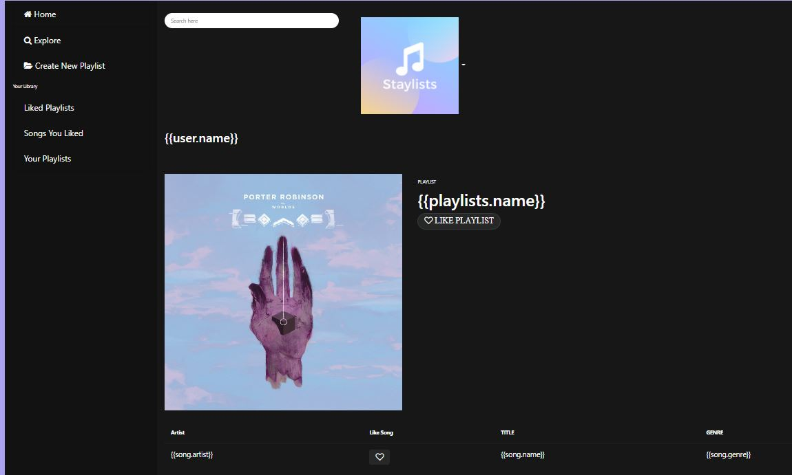
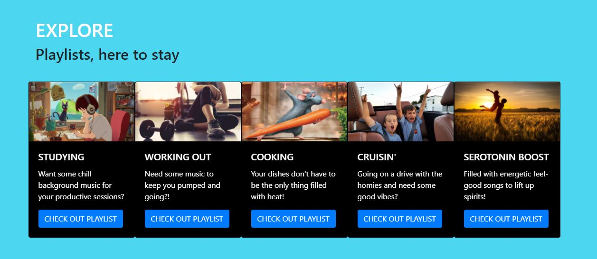

# Staylists
Come for the playlists, stay for a while…

## Description 

People bond over food, travel, sports, and countless other interests.  So why not music, too?  Staylists invites you to share your favorite music and meet some cool people along the way in one application. Working on this application helped our team learn to navigate on a large team with multiple technologies and files. Communication was a major part of the process. 

## Installation

-Create database in MySQL Workbench, use information found in schema.sql
- Run NPM I
-Run Node seeds/seed
-Run NPM start

## Usage

The primary function of the application is to create and share playlists for various users and moods. When a user goes to the website, they can see a few premade playlists for them to use, when a user logs in they can get complete access to the all playlist and sharing functionality on the app. Users can like and share playlist to increase interaction with a specific playlist or mood. The application Staylist is also fully mobile friendly and supports multiple screen sizes. 

##Credits 

Front-end:
Rey Chhorn https://github.com/LYBLRey, 
Shane Le https://github.com/ShaneLe2121, 
Alex Garcia https://github.com/AlexG1040
Back-end: 
Michael Adusah https://github.com/MikeAdu, 
Son Le https://github.com/Sonlocgiau, 
Drew Gillespie https://github.com/drewg07

## Technologies used:
-Node and Express; GET and POST routes
-Animate.style
-Bootstrap
-MySQL
-Sequelize ORM

## Deployed Link: https://still-headland-23293.herokuapp.com/login

## Presentation Link: https://docs.google.com/presentation/d/1lTBwdvGfi2nsxClZWAdnhhGfWgli9KuLOm8UI3W2YuA/edit#slide=id.g29f43f0a72_0_24
